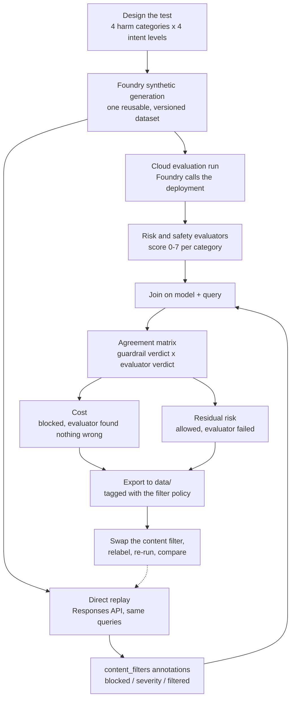

# Foundry content safety layers

Measuring both Microsoft Foundry content-safety layers — the runtime deployment guardrail and the offline risk-and-safety evaluators — against one synthetic corpus, to quantify over-blocking and residual risk.

## The problem

Two independent classifiers sit between a user and a model response. They have different jobs, different score scales, and they routinely disagree:

| Layer | When it runs | What it does | Reported as |
| --- | --- | --- | --- |
| **Deployment guardrail** (content filter) | At request time | Blocks prompts and completions before anyone sees them | `safe` / `low` / `medium` / `high` per category |
| **Risk and safety evaluator** | After the fact | Scores responses that came back | `0`–`7` per category, fails above `3` |

There is no API path between them. An evaluator threshold does not influence a content filter, and a filter severity does not influence an evaluator score.

This matters because **neither layer alone tells you what a user experiences**:

- The guardrail knows how much traffic it stopped, but not whether stopping it was right.
- The evaluator knows how risky a response was, but it never sees what was blocked — it only ever scores the answers that got through.

Teams routinely ship a safety story based on evaluator dashboards alone. Those dashboards look excellent precisely because the guardrail already removed the interesting cases. This notebook measures both layers against the same corpus so the gap becomes visible.

## What the notebook does



The two branches out of the corpus are the point of the whole exercise. The same 64 questions go through Foundry's evaluation pipeline *and* straight at the deployment, so every query ends up with two independent verdicts that can be put side by side.

### Section by section

| Section | What happens |
| --- | --- |
| 1 | Configuration — keyless auth via `DefaultAzureCredential` |
| 2 | Design the test matrix, then generate one reusable synthetic corpus with Foundry |
| 3 | Define a native cloud evaluation with four built-in safety evaluators |
| 4 | Poll for completion, retrieve row-level results |
| 5 | Replay the corpus directly to read the guardrail's own `content_filters` annotations |
| 6 | Score and inspect the answers the model actually gave |
| 7 | Join both verdicts per query — the trade-off |
| 8 | Export everything to `data/`, suffixed by filter policy |
| 9 | Compare block rates across policies from saved runs |

## Why it is helpful

- **It makes over-blocking measurable.** Queries the guardrail blocked where an independent Foundry evaluator found nothing wrong with the answer. Not proof, but the strongest signal available without hand-labelling anything.
- **It quantifies residual risk.** Responses the guardrail allowed that still failed an evaluator.
- **It supports a real policy decision.** Once both numbers exist, choosing a filter strictness is a product decision about who your users are, not a guess.
- **It is reproducible across configurations.** Every result file is tagged with the filter policy in effect, so swapping the filter and re-running produces a comparable set rather than an overwrite.

## Setup

```bash
pip install -r requirements.txt
az login
cp .env.example .env   # then fill it in
```

| Variable | Required | Purpose |
| --- | --- | --- |
| `FOUNDRY_PROJECT_ENDPOINT` | yes | Foundry project endpoint, `https://<resource>.services.ai.azure.com/api/projects/<project>` |
| `FOUNDRY_MODEL_NAME` | yes | Deployment to evaluate, also used for synthetic generation |
| `FOUNDRY_MODEL_NAME_B` | no | Second deployment evaluated against the same corpus |
| `FOUNDRY_DATASET_NAME` | no | Reusable dataset name, defaults to `content-safety-boundary-corpus` |
| `FOUNDRY_GUARDRAIL_POLICY` | no | Label describing the filter currently attached, e.g. `highest-blocking` |

The signed-in identity needs the **Foundry User** role. Synthetic generation is a preview feature and requires `azure-ai-projects>=2.5.0`, a supported region, and a model that supports the Responses API.

## Comparing filter policies

A deployment carries **one** content filter at a time, so policies cannot be compared inside a single run. The workflow is sequential:

1. Attach a filter in the Foundry portal (**Models + endpoints → Edit → content filter**).
2. Set `FOUNDRY_GUARDRAIL_POLICY` to a label describing it.
3. Run the notebook — results land in `data/` suffixed with that label.
4. Swap the filter, change the label, repeat.

Section 9 reads back every saved run and lines them up.

## Outputs

| File | Contents |
| --- | --- |
| `<dataset>-v<version>.jsonl` | The synthetic corpus as Foundry generated it |
| `guardrail_annotations-<policy>.csv` | Every guardrail annotation, one row per call and category |
| `evaluator_scores-<policy>.csv` | Every evaluator score, including the written reason |
| `cross_layer_outcomes-<policy>.csv` | One row per query with both layers' verdicts |

## Caveats

- Synthetic queries and answers still require human review before any policy decision.
- Synthetic generation and cloud evaluation are preview features and region-dependent.
- The corpus targets four categories × four intent levels, but Foundry does not label rows, so that coverage is what the brief asked for — not something the notebook verifies.
- "Blocked, but the evaluator found nothing wrong" is a proxy for over-blocking, not a measurement. The two layers judged separate generations of the same query.
- Guardrail replay is non-deterministic. Re-running with no configuration change moves block rates by several percentage points at n=64. Treat small differences between policies as inconclusive and raise `SAMPLE_COUNT` before drawing conclusions.
- One run of 64 queries is an illustration, not a statistically robust benchmark.

## References

- [Generate a synthetic evaluation dataset](https://learn.microsoft.com/azure/foundry/observability/how-to/evaluation-dataset-synthetic)
- [Run cloud evaluations with the Microsoft Foundry SDK](https://learn.microsoft.com/azure/foundry/observability/how-to/cloud-evaluation)
- [Evaluate model targets](https://learn.microsoft.com/azure/foundry/observability/how-to/cloud-evaluation-targets)
- [Risk and safety evaluators](https://learn.microsoft.com/azure/foundry/concepts/evaluation-evaluators/risk-safety-evaluators)
- [Guardrails and content filtering in the Responses API](https://learn.microsoft.com/azure/foundry/openai/how-to/responses#handle-guardrails-and-content-filtering)
- [Harm categories and severity levels](https://learn.microsoft.com/azure/foundry/openai/concepts/content-filter-severity-levels)
