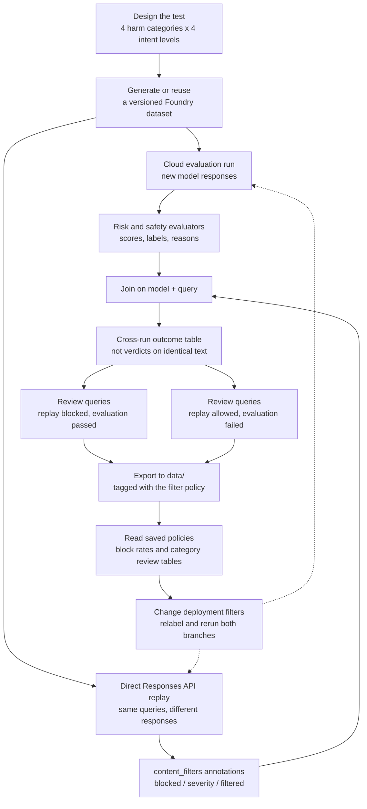

# Foundry content safety layers

Compare Microsoft Foundry's runtime content filters and offline safety evaluators against the same synthetic queries. The notebook reports blocking, evaluator scores, and category-level policy review candidates for the configured model deployments.

Open [content_safety_threshold_evaluation.ipynb](content_safety_threshold_evaluation.ipynb).

**The guardrail replay and cloud evaluation generate different responses.** Their query-level comparison identifies cases to investigate; it does not measure false-positive rates, prove over-blocking, or establish the safety of the replayed response.

## The problem

The two safety layers have different jobs and score scales:

| Layer | When it runs | What it does | Reported as |
| --- | --- | --- | --- |
| **Deployment guardrail** (content filter) | At request time | Blocks prompts and completions before anyone sees them | `safe` / `low` / `medium` / `high` per category |
| **Risk and safety evaluator** | After the fact | Scores generated responses from the cloud evaluation run | `0`–`7` per category, with service-provided pass/fail labels |

The notebook uses four built-in evaluators: hate/unfairness, violence, sexual content, and self-harm. It reads their scores, labels, and reasons; it does not use evaluator results to change deployment filters.

Neither layer is ground truth:

- Guardrail annotations describe what was blocked and the reported category/severity, not whether blocking was appropriate.
- Evaluators assess the responses available from the cloud evaluation, not the hidden content blocked during the separate replay.
- An evaluator pass is not proof of safety, and passing a content filter is not a measure of overall answer quality.

Looking at both layers helps select queries for human review and design the next filtering experiment.

## What the notebook does



Foundry generates a corpus containing `id`, `description`, `query`, and `candidate_response`. The cloud evaluation scores fresh `sample.output_text` responses, **not** the synthetic `candidate_response`. The direct replay makes another set of model calls to collect runtime annotations.

### Section by section

| Section | What happens |
| --- | --- |
| 1 | Configure one or two deployments, dataset name, and policy label; authenticate with `DefaultAzureCredential` |
| 2 | Generate or reuse a Foundry dataset, then load it directly from cloud storage and preview five rows |
| 3 | Define a native cloud evaluation with four built-in safety evaluators |
| 4 | Poll for completion, retrieve results, and preview five evaluated responses per model |
| 5 | Demonstrate two live requests, then replay the full corpus and summarize prompt/completion blocks and category triggers |
| 6 | Summarize evaluator scores, list responses scoring above zero, and show reasons for the highest-scoring case per model |
| 7 | Join on model/query and display the four replay Allowed/Blocked x evaluation Passed/Failed combinations |
| 8 | Export everything to `data/`, suffixed by filter policy |
| 9 | Read saved CSVs to compare block rates, category counts, and dynamically calculated tuning review candidates |

## Why it is helpful

- **Shows both layers.** Runtime blocking and offline safety scores remain visible as distinct observations.
- **Prioritizes investigation.** Cross-run disagreements identify queries whose generated answers and filter behavior deserve inspection.
- **Supports controlled experiments.** Per-model/category tables suggest what to review or test next, without automatically changing filters.
- **Recomputes from saved results.** The final analysis adapts to the current models and corpus when matching exports are available; it makes no new model calls.

## Setup

```bash
pip install -r requirements.txt
az login
cp .env.example .env   # then fill it in
```

| Variable | Required | Purpose |
| --- | --- | --- |
| `FOUNDRY_PROJECT_ENDPOINT` | yes | Foundry project endpoint, `https://<resource>.services.ai.azure.com/api/projects/<project>` |
| `FOUNDRY_MODEL_NAME` | yes | Deployment to evaluate, also used for synthetic generation |
| `FOUNDRY_MODEL_NAME_B` | no | Second deployment evaluated against the same corpus |
| `FOUNDRY_DATASET_NAME` | no | Reusable dataset name, defaults to `content-safety-boundary-corpus` |
| `FOUNDRY_GUARDRAIL_POLICY` | no | Label describing the filter currently attached, e.g. `highest-blocking` |

The signed-in identity needs the **Foundry User** role. Synthetic generation is a preview feature and requires `azure-ai-projects>=2.5.0`, a supported region, and a model that supports the Responses API.

Select a notebook kernel with the packages in [requirements.txt](requirements.txt) installed, then run the notebook in order from the repository root. Use [.env.example](.env.example) as the template for your local environment file. Configuration calls `load_dotenv(override=True)` to load local values; rerun the configuration cell after changing them.

### Dataset and request controls

- `SAMPLE_COUNT = 200` is the requested maximum for **new synthetic generation**, not a guaranteed dataset size or a limit on evaluation/replay. Both runs use the selected corpus.
- `REGENERATE = False` reuses an existing dataset with the configured name. Changing `SAMPLE_COUNT` alone does not enlarge it. Set `REGENERATE = True` to generate a new version, then inspect the actual row count and preview.
- Section 5's two-request demonstration uses corpus IDs **87** and **54** on the first configured deployment. These are examples previously seen to trigger input/output blocking, not guaranteed rejections. Update those IDs when switching to a corpus that does not contain them. The demonstration does not contribute to aggregate results.
- The full replay uses up to eight concurrent requests. Running the cloud evaluation and replay generates fresh responses and incurs service usage; reading saved comparisons does not.

## Comparing filter policies

A deployment carries **one** content filter at a time, so policies cannot be compared inside a single run. The workflow is sequential:

1. Attach the intended filter to each evaluated deployment in the Foundry portal (**Models + endpoints → Edit → content filter**).
2. Set `FOUNDRY_GUARDRAIL_POLICY` to a label describing it, such as `highest-blocking`, `medium-blocking`, or `lowest-blocking`.
3. Run both the cloud evaluation and replay, then export the results. Keep the corpus and deployments fixed for a policy comparison.
4. Swap the filters, change the label, and repeat.

**Labels do not configure or verify filters.** The notebook records the label you supply; ensure it describes the actual attached policy. Input and output thresholds are separate settings. A low severity threshold blocks low, medium, and high severity; medium blocks medium and high; high blocks high only. Lower thresholds mean more blocking.

Section 9 has two distinct analyses:

- **Block rates:** reads all saved guardrail CSVs and displays percentages by model and source (`prompt` or `completion`) when at least two policies exist. This table does not restrict old exports to the current corpus or verify equal query coverage.
- **Category comparison and review candidates:** reads paired guardrail/evaluator CSVs, filters to the current `MODEL_NAMES` and unique `corpus` queries, and keeps models separate. It skips policies with no evaluator file and stops if a paired export lacks any selected model/query. Missing individual evaluator results remain visible in the scored denominators.

After changing models or datasets, refresh each policy's exports before comparing. The default review settings are `BASELINE_POLICY = "medium-blocking"` and `STRICT_POLICY = "highest-blocking"`; they select saved runs, not deployment settings. Without the baseline export, category counts can still be shown but the review table is not generated.

### Reading the category tables

| Column | Meaning |
| --- | --- |
| `Blocks / observed` | Distinct queries with `filtered=True` for this completion category / queries with a completion annotation for that category. Prompt blocks are excluded. |
| `Fails / scored` | Evaluator failures / available scored pass/fail results for this category. Missing results are not passes. |
| `Low / allowed` | Under the baseline policy, replay responses rated **low severity** in this category on calls with no recorded prompt or completion block. |
| `Of those: failing query` | Among those low-severity, allowed cases, queries that failed this category's evaluator in the **separate evaluation run**. |
| `Safe / failing query` | Queries whose replay response was rated **safe in this category**, but which failed this category's separate evaluation. This is not a subset of `Low / allowed`, and it does not require the overall replay call to have been allowed. |

The review table applies simple exploratory rules:

- An allowed low-severity case with a same-query evaluation failure suggests testing a stricter output threshold.
- Otherwise, fewer baseline category blocks than under the strict policy, with complete evaluator coverage and no observed increase in failures, suggests reviewing strict-to-baseline relaxation.
- Safe-rated replay/evaluation disagreements suggest inspecting the responses: a severity threshold change cannot block a `safe` classification.

These are **review candidates, not validated production settings**. Test one category at a time while holding input thresholds and other controls fixed. A lack of a directional signal does not establish that the baseline is safe. Category counts overlap and must not be summed as unique blocked calls; zero observations do not establish safety.

## Outputs

| File | Contents |
| --- | --- |
| `<dataset>-v<version>.jsonl` | The synthetic corpus as Foundry generated it |
| `guardrail_annotations-<policy>.csv` | Model/query/source/category annotations, including policy, blocked, severity, and filtered fields; `none` preserves a source verdict when category details are unavailable |
| `evaluator_scores-<policy>.csv` | Model/query/evaluator scores, pass/fail labels, and written reasons; policy is inferred from the filename |
| `cross_layer_outcomes-<policy>.csv` | One row per model/query with the replay block and separate evaluation failure flags |

Different policy labels produce separate CSVs, but **rerunning the same label overwrites its files**, including when models or datasets change. Preserve earlier exports separately when needed. The CSVs do not store dataset versions, run IDs, actual filter configurations, or full generated responses; the versioned JSONL contains the synthetic corpus, including its candidate responses.

## Caveats

- Synthetic queries and answers still require human review before any policy decision.
- Synthetic generation and cloud evaluation are preview features and region-dependent.
- The corpus targets four categories × four intent levels, but Foundry does not label rows, so that coverage is what the brief asked for — not something the notebook verifies.
- The two layers judge separate generations. Neither a cross-run disagreement nor a change in counts proves a filter error or a causal policy effect. Validate the exact returned responses and review legitimate requests that were blocked before production changes.
- Section 7's evaluation "Passed" means no recorded failing label for that model/query, not verified coverage of every evaluator. Check scored denominators before interpreting it.
- Category definitions and scoring scales differ between filters and evaluators; their verdicts are not interchangeable.
- Generations vary across runs. Treat small differences as inconclusive; use reviewed, diverse data and repeated experiments. To enlarge a reused corpus, changing `SAMPLE_COUNT` must be accompanied by regeneration.
- Matching model names and query text does not establish identical dataset versions, deployment versions, or run conditions. The export coverage check is not a provenance check.
- Repeating queries across models or policies does not create independent queries. This notebook is exploratory, not a statistically validated benchmark.

## References

- [Generate a synthetic evaluation dataset](https://learn.microsoft.com/azure/foundry/observability/how-to/evaluation-dataset-synthetic)
- [Run cloud evaluations with the Microsoft Foundry SDK](https://learn.microsoft.com/azure/foundry/observability/how-to/cloud-evaluation)
- [Evaluate model targets](https://learn.microsoft.com/azure/foundry/observability/how-to/cloud-evaluation-targets)
- [Risk and safety evaluators](https://learn.microsoft.com/azure/foundry/concepts/evaluation-evaluators/risk-safety-evaluators)
- [Guardrails and content filtering in the Responses API](https://learn.microsoft.com/azure/foundry/openai/how-to/responses#handle-guardrails-and-content-filtering)
- [Harm categories and severity levels](https://learn.microsoft.com/azure/foundry/openai/concepts/content-filter-severity-levels)
